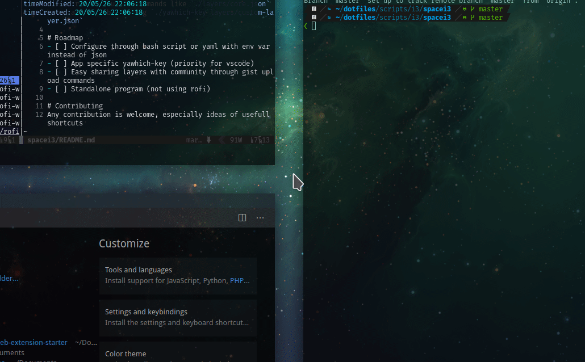

# yawhich-key

This repository is a work in progress

An universal which-key shortcut displayer inspired from emacs-which-key 



# Get started

### Shortcuts
Create two shortcuts with your favorite shortcut manager
```bash
bash ~/path/to/yawhich-key # (minor mode) for default commands, conventionaly on space
bash ~/path/to/yawhich-key --major #(major mode) for application specific commands, conventionaly on comma
```
#### i3

```
bindsym $mod+space exec "bash ~/path/to/yawhich-key"
bindsym $mod+comma exec "bash ~/path/to/yawhich-key --major"

```

### Create config 
```bash
mkdir ${XDG_CONFIG_HOME:=$HOME/.config}/yawhich-key
$EDITOR ${XDG_CONFIG_HOME:=$HOME/.config}/yawhich-key/config.yaml
```

```yaml
# .config/yawhich-key/config.yaml
commands:
  editor: code
  terminal: kitty
  terminal_hold: kitty --hold
  browser: vivaldi-snapshot
property:
  # Here you can override default options (man rofi)
  rofi_options: -lines 5 -location 6
```


###  Minor mode (general short cut map)
`./yawhich-key`

Configure your custom commands inside `./layers/core.yaml` (core.yaml is the entry point by default) and chain them by calling `./yawhich-key layers/custom-layer.yaml`
(of course yawich-key is unixporn compliant and can be customized through pywal, themer, env variable)
```yaml
// foo.yaml
- command: foo # the command to be executed
  name: +foo # the '+' char indicate which key to use in the menu
  confirm: true # will ask for confirmation

- command: ./yawhich-key layers/barmenu.yaml # to nest menu just call the appropriate layer
  name: +barmenu
```


###  Major mode (current window class specific)
`./yawhich-key --major` will search the matching currently focused window WM_CLASS in `layers/wm_class.yaml`
If nothing is found it will `notifiy-send an error`


# Limitation
- Not yet in config folder
- Cant use special keys like `space, esc, alt, meta...` only chars
- Cant use two same key in a same menu
- If you press a wrong secquence or delete the invisible character the match wont work. (every time you open yawhich-key an invisible character is inserted in the search and this is what allow me to match by only pressing one key)
- Cant go back

# Roadmap
- [x] Basic secquence key handling
- [x] Configure through bash script or yaml with env var instead of json
- [x] App specific yawhich-key
- [ ] Easy sharing layers with community through gist upload commands (inspired by pet)
- [ ] Standalone program (not using rofi), handle special keys shortcuts

# Changelog
[CHANGELOG.md](./CHANGELOG.md)

# Contributing
Any contribution is welcome, especially ideas of usefull shortcuts,
themes, tackling ongoing issues, security issues / fix !
